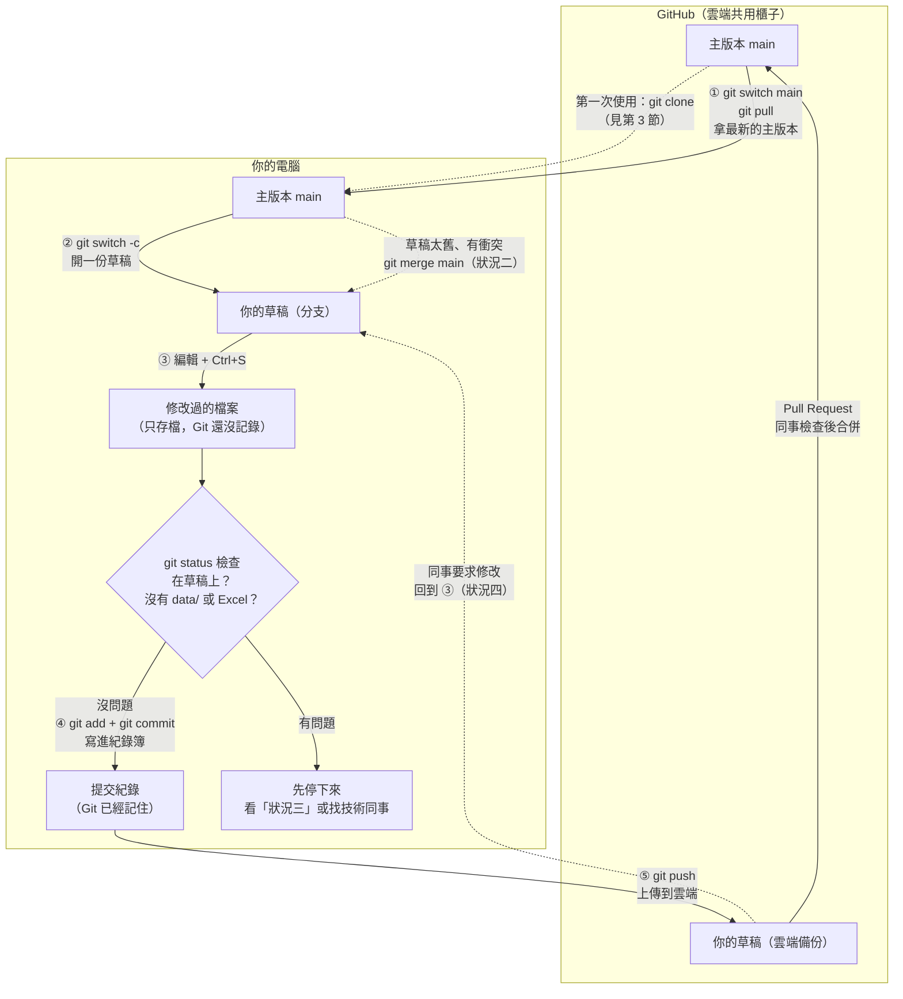
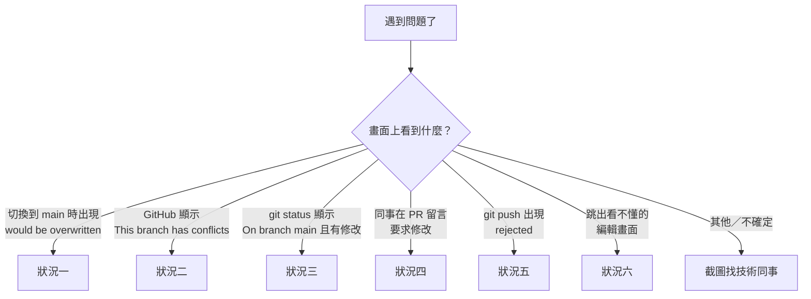

# Git 使用說明

**目錄**
1. 流程總覽
2. 基本觀念
3. 第一次使用：環境設定
4. 每天工作的 6 個步驟
5. 常見狀況與解法
6. 工程師專用：分支管理與進階操作

---

## 1. 流程總覽



**怎麼看這張圖：**
- **下面是你的電腦，上面是雲端。** 只有 `git pull`（往下拿）和 `git push`（往上放）會在兩邊之間傳東西。
- **存檔 ≠ 提交。** 按 Ctrl+S 只是存在電腦裡；要做完 ④，Git 才會記住。
- **提交前一定先 `git status`。** 確認自己在草稿上、清單裡沒有資料檔，才能提交。
- **你只改草稿，不直接改主版本。** 主版本只能經過同事檢查（Pull Request）後才會更新。
- **實線是每天的正常流程，虛線是第一次使用或遇到狀況時才走的路。**
- **合併完成後**，回到 ① 重新開始下一件工作，舊草稿可以刪除（步驟 ⑥）。

> 這張圖在 GitHub 網頁上會自動畫出來。如果在 VS Code 裡只看到文字，可以安裝「Markdown Preview Mermaid Support」擴充套件。

---

## 2. 基本觀念

### Git 是什麼
Git 就像專案的「**修改紀錄簿**」：每次「提交」都會記下誰在什麼時候改了什麼，改壞了也能回到以前的版本。
GitHub 則是放在網路上的「**共用櫃子**」，大家都從這裡拿最新版本，也把自己改好的東西放回這裡。

### 常用名詞
| 詞 | 意思 |
|---|---|
| **存檔** | 在編輯器按 Ctrl+S（Mac 是 Cmd+S），跟平常一樣。只存在你的電腦，Git 還沒記錄。 |
| **暫存（add）** | 用 `git add` 挑出「這次要提交的檔案」，像是把要寄的東西先放進信封。 |
| **提交（commit）** | 用 `git commit` 把暫存的修改**寫進紀錄簿**。存檔之後還要提交，Git 才算記住。 |
| **主版本（main）** | 大家共用的正式版本。 |
| **草稿（分支）** | 你自己的工作副本。改壞了也不會影響別人。 |
| **遠端（origin）** | 指 GitHub 上的那份專案。指令裡看到 `origin` 就是「雲端」的意思。 |
| **Pull Request（PR）** | 在 GitHub 上提出「請幫我檢查，沒問題就放進主版本」的請求。 |

### 三條規則（一定要遵守）
1. **不要直接改主版本**：先開一份自己的草稿再改，改好請人看過才放回主版本。
2. **不要上傳真實資料**：員工姓名、工作量、工單、Excel 檔都放在 `data/` 資料夾。這個資料夾已經寫在專案的 `.gitignore`（「不要上傳清單」）裡，所以 Git 會自動略過它。
   - **只有放在 `data/` 裡的檔案才受保護。** 如果把資料檔放在其他資料夾（例如桌面拖進來、放在 `brain/` 裡），Git 一樣會把它上傳。
   - 上傳前先用 `git status` 看一下清單，有疑問就停下來問人。
3. **提交時寫清楚改了什麼**：別人一看就知道你做了什麼。

---

## 3. 第一次使用：環境設定

> 每台電腦只需要做一次。不確定的話，請技術同事陪你做。

**第 1 步：安裝 Git**
- Windows：到 https://git-scm.com 下載安裝，選項全部用預設值即可。
- Mac：打開終端機輸入 `git --version`，如果沒安裝，系統會跳出視窗提示安裝。

安裝後輸入下面指令，有出現版本號碼就代表成功：
```
git --version
```

**第 2 步：告訴 Git 你是誰**（提交紀錄會顯示這個名字）
```
git config --global user.name "你的名字"
git config --global user.email "你的公司信箱"
```
信箱請用跟 GitHub 帳號相同的那個。

**第 3 步：取得 GitHub 權限**
- 請負責人把你的 GitHub 帳號加入專案。
- 第一次 `git clone` 或 `git push` 時會跳出登入視窗，照畫面指示登入 GitHub 即可。如果畫面要求輸入密碼卻一直失敗，請找技術同事協助設定登入方式。

**第 4 步：把專案下載到電腦**（`git clone`）
在 GitHub 專案頁面按綠色的「**Code**」按鈕，複製網址，然後在終端機輸入：
```
git clone 複製的網址
cd 專案資料夾名稱
```
之後每次工作，都要在這個專案資料夾裡打開終端機。

**第 5 步：確認設定完成**
```
git status
```
第一行出現 `On branch main` 就代表一切就緒，可以開始第 4 節的每日流程。

---

## 4. 每天工作的 6 個步驟

在專案資料夾裡打開終端機（Terminal），照順序輸入：

**① 拿最新的主版本**
```
git switch main
git pull
```
- 如果 `git switch main` 出現錯誤，看「狀況一」。
- 如果 `git pull` 出現 `divergent branches` 之類的訊息，代表之前不小心在主版本上提交過，看「狀況三」。

**② 開一份自己的草稿**
```
git switch -c 我的名字-要做的事
```
例：`git switch -c amy-update-glossary`

草稿名字規則：
- 只用**英文小寫、數字、減號（-）**，不要有空格或中文。
- 格式建議：`名字-做什麼事`，讓人一看就知道是誰、在做什麼。
- 一份草稿只做一件事，做完就合併，不要一份草稿用好幾週。

**③ 修改檔案並存檔**（照平常的方式編輯，按 Ctrl+S）

**④ 檢查後提交**
```
git status
```
先檢查兩件事：
- **第一行**應該是 `On branch 你的草稿名字`。如果寫的是 `On branch main`，先停下來，看「狀況三」。
- **檔案清單**裡如果出現 `data/`、Excel 檔（`.xlsx`、`.csv`）或任何含真實資料的檔案，先停下來，找技術同事。

確認沒問題後再輸入：
```
git add .
git commit -m "這次改了什麼"
```
> `git add .` 會把**所有**改過的檔案都放進去，所以前面的 `git status` 檢查非常重要。

**⑤ 上傳，請人檢查**
```
git push -u origin 我的名字-要做的事
```
（`-u` 只有第一次上傳這份草稿時需要。之後同一份草稿再上傳，只要輸入 `git push`。）

接著打開 GitHub 網頁，按綠色的「**Compare & pull request**」，寫一句說明後送出。
如果沒看到這個按鈕，到「**Pull requests**」分頁按「**New pull request**」，選你的草稿即可。

送出後等同事檢查：
- 同事核准並合併 → 繼續 ⑥。
- 同事留言要求修改 → 看「狀況四」。

**⑥ 合併後收尾**
你的修改進入主版本後，把電腦上的舊草稿清掉，準備下一件工作：
```
git switch main
git pull
git branch -d 我的名字-要做的事
```
雲端上的草稿可以在 PR 頁面按「**Delete branch**」刪除。下次有新工作，從 ① 重新開始。

### 範例：Amy 要修改名詞說明文件

```
git switch main
git pull
git switch -c amy-update-glossary
```
（Amy 打開 `brain/_core/glossary.md`，加了一個新名詞，按 Ctrl+S 存檔）
```
git status
```
（確認第一行是 `On branch amy-update-glossary`，清單裡只有 `glossary.md`）
```
git add .
git commit -m "名詞說明：新增「進線量」的定義"
git push -u origin amy-update-glossary
```
（到 GitHub 網頁按「Compare & pull request」→ 送出 → 同事確認並合併）
```
git switch main
git pull
git branch -d amy-update-glossary
```

### 提交說明怎麼寫
格式建議：`改了哪個部分：做了什麼`
- 好：`名詞說明：新增「進線量」的定義`、`修正 DW 報表 Promo 少算`
- 不好：`更新`、`修改`、`aaa`（別人看不出改了什麼）

一次提交只放一件相關的事。如果同時改了兩件不相關的事，建議分兩份草稿做。

---

## 5. 常見狀況與解法

> 這些狀況**都不會弄壞任何東西**，照著做就好。做到一半不確定，就截圖找技術同事。



### 狀況一：忘了提交，就想去拿新版本
**什麼時候會遇到：** 做步驟 ① 的 `git switch main` 時，畫面出現：
```
error: Your local changes to the following files would be overwritten by checkout
```
**意思：** 你上次的修改有存檔，但還沒提交。Git 怕切換時弄丟這些修改，所以先擋下來。

**解法：** 留在原本的草稿，把上次的修改先提交，再重新做步驟 ①。
```
git status
git add .
git commit -m "上次改了什麼"
git switch main
git pull
```
（`git status` 第一行應該是你的草稿名字。如果是 `main`，改看「狀況三」。）

### 狀況二：草稿太舊，跟主版本衝突
**什麼時候會遇到：** 送出 PR 後，GitHub 網頁顯示「**This branch has conflicts**」。
**意思：** 你開草稿之後，別人也改了同一個檔案的同一段。Git 不知道要留哪個版本，要你決定。

**解法：**

第 1 步：把最新的主版本拿進你的草稿
```
git switch main
git pull
git switch 我的名字-要做的事
git merge main --no-edit
```
（`--no-edit` 可以避免跳出編輯畫面，見「狀況六」。）
- 沒有出現 `CONFLICT`：直接輸入 `git push`，完成。
- 出現 `CONFLICT (content): Merge conflict in 某個檔案`：繼續第 2 步。

第 2 步：打開畫面上寫的那個檔案，會看到這樣的標記：
```
<<<<<<< HEAD
你的版本
=======
別人的版本（主版本）
>>>>>>> main
```
決定要留哪些內容，改成正確的樣子，並**刪掉 `<<<<<<<`、`=======`、`>>>>>>>` 這三行標記**，然後存檔。
如果有好幾個檔案衝突，每個檔案都要這樣處理。可以用 `git status` 查看還有哪些檔案標示為 `both modified`。

> 用 VS Code 打開時，衝突處上方會出現「Accept Current Change／Accept Incoming Change／Accept Both Changes」按鈕，點選也可以。

第 3 步：提交並上傳
```
git add 那個檔案
git commit -m "解決衝突：說明你留了哪個版本"
git push
```
回到 GitHub 頁面，衝突提示會消失，PR 會自動更新。

**想放棄、回到合併前的樣子：** 在第 3 步之前輸入 `git merge --abort`。

**範例**（Amy 的草稿太舊）：
```
git switch main
git pull
git switch amy-update-glossary
git merge main --no-edit
（出現 CONFLICT → 打開 glossary.md，整理成正確內容、刪掉三行標記、存檔）
git add brain/_core/glossary.md
git commit -m "解決衝突：保留兩邊新增的名詞"
git push
```

### 狀況三：不小心在主版本上改了東西
**什麼時候會遇到：** 輸入 `git status`，第一行寫的是 `On branch main`，下面卻列出你改過的檔案。
**意思：** 你忘了做步驟 ②，直接在主版本上改了。

**解法：還沒提交的話**，直接開一份草稿，修改會自動一起帶過去：
```
git switch -c 我的名字-要做的事
```
然後從步驟 ④ 繼續就好。

**如果已經提交了**（已經輸入過 `git commit`）：先不要輸入 `git push`，截圖找技術同事處理（處理方式見第 6 節）。

### 狀況四：同事要求修改
**什麼時候會遇到：** PR 頁面上，同事留言說某些地方要改。
**解法：** 不用重開草稿，也不用重開 PR。留在原本的草稿繼續改：
```
git switch 我的名字-要做的事
```
（修改檔案、存檔）
```
git status
git add .
git commit -m "依審查意見修改：說明改了什麼"
git push
```
上傳後 PR 會自動更新，回到 PR 頁面回覆同事「已修改」即可。

### 狀況五：上傳被拒絕
**什麼時候會遇到：** 輸入 `git push` 時出現：
```
! [rejected]  ...  (fetch first)
```
**意思：** 雲端上的草稿比你電腦上的新（例如你在另一台電腦也上傳過，或同事幫你改過）。
**解法：** 先把雲端的版本拿下來，再上傳：
```
git pull --no-edit
git push
```
如果 `git pull` 出現 `CONFLICT`，照「狀況二」第 2、3 步處理。

> 看到 rejected **絕對不要**用 `git push --force`，那會蓋掉雲端上的內容。

### 狀況六：跳出看不懂的編輯畫面
**什麼時候會遇到：** 輸入 `git merge`、`git pull` 或忘了加 `-m` 的 `git commit` 後，終端機變成一個全黑或全白的畫面，打字沒反應或很奇怪。
**意思：** Git 打開了一個文字編輯器（通常是 Vim），要你寫提交說明。
**解法：** 依序按：
1. 按 `Esc`
2. 輸入 `:wq`（冒號、w、q）
3. 按 `Enter`

畫面就會回到終端機，操作已完成。
如果畫面最下面寫的是 `GNU nano`，則改按 `Ctrl+X`。

### 其他問題

| 狀況 | 做法 |
|---|---|
| 不確定自己現在在主版本還是草稿 | 輸入 `git status`，看第一行的 `On branch ...` |
| 忘記草稿叫什麼名字 | 輸入 `git branch`，前面有 `*` 的就是目前所在的草稿 |
| 想放棄某個檔案還沒提交的修改 | 找技術同事。指令會讓修改**直接消失、無法復原** |
| 不小心把資料檔上傳了 | **立刻通知負責人**，不要自己處理，也不要再 push 其他東西 |
| 看不懂畫面上的訊息 | 截圖給技術同事 |

> 修改 `brain/` 裡的程式或規則設定後，還要跑檢查工具（`check_all.py` 等）。這部分由**技術同事在合併前處理**，非技術成員不用擔心。

---

## 6. 工程師專用：分支管理與進階操作

### 切換分支

**切到現有分支**
```
git switch 分支名字
```

**切到雲端上有、本地還沒有的分支**（例如接手同事的草稿）
```
git fetch
git switch 分支名字
```

**建立新分支並切過去**
```
git switch -c 新分支名字
```

**查看所有分支（本地 + 遠端）**
```
git branch -a
```

### 刪除分支

**刪除本地分支（已合併的分支，安全刪除）**
```
git branch -d 分支名字
```

**強制刪除本地分支（包含未合併的提交）**
```
git branch -D 分支名字
```
> 若分支是在 GitHub 上用 Squash 或 Rebase 方式合併，`-d` 可能會顯示「not fully merged」。先確認 PR 已合併，再用 `-D`。

**刪除遠端分支（雲端）**
```
git push origin --delete 分支名字
```
或簡寫：
```
git push origin -d 分支名字
```

**同時刪除本地 + 遠端**
```
git branch -d 分支名字
git push origin -d 分支名字
```

**清掉雲端已刪除、本地還留著的分支紀錄**
```
git fetch --prune
```

### 合併分支到 main

**步驟 1：確保本地 main 是最新版本**
```
git switch main
git pull
```

**步驟 2：切到你的分支，確認所有修改都已提交**
```
git switch 我的分支名字
git status
```
如果有未提交的修改，先執行：
```
git add .
git commit -m "提交說明"
```

**步驟 3：把最新的 main 合進分支，先在本地處理衝突並跑檢查**
```
git merge main --no-edit
python check_all.py
```
（檢查工具的實際路徑與參數依專案設定。）

**步驟 4：建立 Pull Request（推薦做法）**
```
git push -u origin 我的分支名字
```
在 GitHub 網頁上按「**Compare & pull request**」，填寫說明，等待審查。有人核准後，在 GitHub 點「**Merge pull request**」完成合併。

**步驟 5：合併後清理**
```
git switch main
git pull
git branch -d 我的分支名字
```

**如果有衝突**：參考第 5 節的「狀況二」。

### 處理非技術同事的常見求助

**在 main 上提交了、還沒 push**（狀況三的後半）
```
git status                     # 先確認工作區是乾淨的
git switch -c 新分支名字        # 新分支帶走這些提交
git switch main
git fetch
git reset --hard origin/main   # 本地 main 回到雲端狀態
```
> `reset --hard` 會丟掉所有未提交的修改，執行前務必確認 `git status` 是乾淨的。

**資料檔已提交、還沒 push**
```
git rm --cached 檔案路徑         # 從 Git 移除，但保留電腦上的檔案
git commit --amend --no-edit    # 把移除動作併進最後一次提交
```
如果資料檔在更早的提交裡，需要改寫歷史（例如 `git rebase -i`），請在本地處理完再 push，並確認 `.gitignore` 已涵蓋該檔案。

**資料檔已經 push 到雲端**
- 只刪掉檔案再提交**不夠**，舊提交裡仍查得到。
- 立即通知負責人，評估是否需要改寫遠端歷史、請所有人重新 clone，並視情況通報資料外洩流程。
- 若內容包含密碼或金鑰，**一律視為已外洩並更換**。

### 常用指令速查

**查看狀態與紀錄**
| 指令 | 用途 |
|---|---|
| `git status` | 目前分支、哪些檔案改過／已加入暫存 |
| `git log --oneline --graph --all` | 精簡版提交歷史，含分支圖 |
| `git log -p 檔案` | 某個檔案每次提交改了什麼 |
| `git diff` | 尚未 `add` 的修改內容 |
| `git diff --staged` | 已 `add`、尚未 `commit` 的修改內容 |
| `git diff main...分支名字` | 分支相對 main 改了什麼（等同 PR 會看到的差異） |
| `git branch -vv` | 本地分支、追蹤的遠端分支、領先／落後幾個提交 |
| `git remote -v` | 遠端倉庫網址 |
| `git check-ignore -v 檔案` | 確認某個檔案是否被 `.gitignore` 排除、被哪一條規則排除 |

**同步遠端**
| 指令 | 用途 |
|---|---|
| `git fetch` | 下載遠端最新狀態，**不改動**本地檔案 |
| `git fetch --prune` | 同上，並清掉雲端已刪除的分支紀錄 |
| `git pull` | `fetch` + 合併到目前分支 |
| `git pull --rebase` | `fetch` + 把本地提交接在遠端最新之後（歷史較乾淨） |
| `git push` | 上傳目前分支（已設定追蹤時） |
| `git push --force-with-lease` | 改寫**自己獨用**分支的歷史後上傳；若雲端有別人的新提交會拒絕。**禁止用在 main** |

**暫時收起修改**
| 指令 | 用途 |
|---|---|
| `git stash` | 把未提交的修改先收起來，工作區回到乾淨狀態 |
| `git stash -u` | 同上，連新建（未追蹤）的檔案一起收 |
| `git stash list` | 查看收起來的清單 |
| `git stash pop` | 拿回最近一次收起的修改 |

**復原修改**
| 指令 | 用途 | 注意 |
|---|---|---|
| `git restore 檔案` | 放棄某檔案尚未 `add` 的修改 | **修改會直接消失，無法復原** |
| `git restore --staged 檔案` | 把檔案移出暫存（取消 `add`），修改保留 | 安全 |
| `git commit --amend` | 修改最後一次提交（訊息或補檔案） | 只能用在**尚未 push** 的提交 |
| `git reset --soft HEAD~1` | 取消最後一次提交，修改留在暫存區 | 只能用在**尚未 push** 的提交 |
| `git revert 提交編號` | 新增一個提交來抵銷指定提交 | 已 push 的提交用這個復原 |
| `git cherry-pick 提交編號` | 把某個提交複製到目前分支 | 可能產生衝突，處理方式同「狀況二」 |
| `git reflog` | 查看 HEAD 移動紀錄，可找回誤刪的分支或被 reset 掉的提交 | 救援用 |

> 已經 push 到**共用分支**（特別是 main）的提交，**不要**用 `reset` 或 `--amend` 改寫，也不要 `git push --force`，會蓋掉別人拿到的歷史。需要復原時用 `git revert`。

### 建議的 GitHub 設定（由管理者設定）
- **保護 main 分支**：Settings → Branches，開啟「Require a pull request before merging」，並禁止 force push，從源頭避免有人直接改主版本。
- **合併後自動刪除分支**：Settings → General，勾選「Automatically delete head branches」，省去手動刪除雲端草稿。
- **定期檢查 `.gitignore`**：新增資料夾或資料格式時，確認是否需要加入排除清單。
