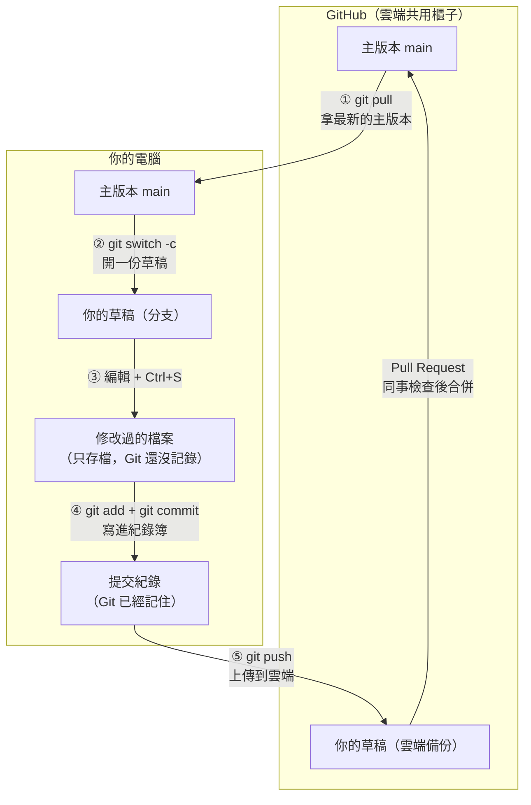

# Git 使用說明

**目錄**
1. 流程總覽
2. 基本觀念
3. 每天工作的 5 個步驟
4. 常見狀況與解法
5. 工程師專用：分支管理

---

## 1. 流程總覽



**怎麼看這張圖：**
- **下面是你的電腦，上面是雲端。** 只有 `git pull`（往下拿）和 `git push`（往上放）會在兩邊之間傳東西。
- **存檔 ≠ 提交。** 按 Ctrl+S 只是存在電腦裡；要做完 ④，Git 才會記住。
- **你只改草稿，不直接改主版本。** 主版本只能經過同事檢查（Pull Request）後才會更新。

> 這張圖在 GitHub 網頁上會自動畫出來。如果在 VS Code 裡只看到文字，可以安裝「Markdown Preview Mermaid Support」擴充套件。

---

## 2. 基本觀念

### Git 是什麼
Git 就像專案的「**修改紀錄簿**」：每次「提交」都會記下誰在什麼時候改了什麼，改壞了也能回到以前的版本。
GitHub 則是放在網路上的「**共用櫃子**」，大家都從這裡拿最新版本，也把自己改好的東西放回這裡。

### 四個名詞
| 詞 | 意思 |
|---|---|
| **存檔** | 在編輯器按 Ctrl+S（Mac 是 Cmd+S），跟平常一樣。只存在你的電腦，Git 還沒記錄。 |
| **提交** | 用 `git commit` 把修改**寫進紀錄簿**。存檔之後還要提交，Git 才算記住。 |
| **主版本（main）** | 大家共用的正式版本。 |
| **草稿（分支）** | 你自己的工作副本。改壞了也不會影響別人。 |

### 三條規則（一定要遵守）
1. **不要直接改主版本**：先開一份自己的草稿再改，改好請人看過才放回主版本。
2. **不要上傳真實資料**：員工姓名、工作量、工單、Excel 檔都放在 `data/` 資料夾，那裡的東西本來就不會上傳。上傳前先看一下清單，有疑問就停下來問人。
3. **提交時寫清楚改了什麼**：別人一看就知道你做了什麼。

---

## 3. 每天工作的 5 個步驟

在專案資料夾裡打開終端機（Terminal），照順序輸入：

**① 拿最新的主版本**
```
git switch main
git pull
```
如果這裡出現錯誤，看下面的「狀況一」。

**② 開一份自己的草稿**（名字自己取，英文、不要有空格）
```
git switch -c 我的名字-要做的事
```
例：`git switch -c amy-update-glossary`

**③ 修改檔案並存檔**（照平常的方式編輯，按 Ctrl+S）

**④ 提交**
```
git status
git add .
git commit -m "這次改了什麼"
```
輸入 `git status` 後先檢查兩件事：
- **第一行**應該是 `On branch 你的草稿名字`。如果寫的是 `On branch main`，先停下來，看「狀況三」。
- **檔案清單**裡如果出現 `data/` 或 Excel 檔，先停下來，找技術同事。

**⑤ 上傳，請人檢查**
```
git push -u origin 我的名字-要做的事
```
接著打開 GitHub 網頁，按綠色的「**Compare & pull request**」，寫一句說明後送出。
有人確認沒問題，就會把你的修改放進主版本。

### 範例：Amy 要修改名詞說明文件

```
git switch main
git pull
git switch -c amy-update-glossary
```
（Amy 打開 `brain/_core/glossary.md`，加了一個新名詞，按 Ctrl+S 存檔）
```
git status
git add .
git commit -m "名詞說明：新增「進線量」的定義"
git push -u origin amy-update-glossary
```
（到 GitHub 網頁按「Compare & pull request」→ 送出 → 等同事確認）

**提交說明怎麼寫：**
- 好：`名詞說明：新增「進線量」的定義`、`修正 DW 報表 Promo 少算`
- 不好：`更新`、`修改`、`aaa`（別人看不出改了什麼）

---

## 4. 常見狀況與解法

> 這些狀況**都不會弄壞任何東西**，照著做就好。做到一半不確定，就截圖找技術同事。

### 狀況一：忘了提交，就想去拿新版本
**什麼時候會遇到：** 做步驟 ① 的 `git switch main` 時，畫面出現：
```
error: Your local changes to the following files would be overwritten by checkout
```
**意思：** 你上次的修改有存檔，但還沒提交。Git 怕切換時弄丟這些修改，所以先擋下來。

**解法：** 留在原本的草稿，把上次的修改先提交，再重新做步驟 ①。
```
git status
git add .
git commit -m "上次改了什麼"
git switch main
git pull
```
（`git status` 第一行應該是你的草稿名字。如果是 `main`，改看「狀況三」。）

### 狀況二：草稿太舊，跟主版本衝突
**什麼時候會遇到：** 送出檢查請求後，GitHub 網頁顯示「**This branch has conflicts**」。
**意思：** 你開草稿之後，別人也改了同一個檔案的同一段。Git 不知道要留哪個版本，要你決定。

**解法：**

第 1 步：把最新的主版本拿進你的草稿
```
git switch main
git pull
git switch 我的名字-要做的事
git merge main
```
- 沒有出現 `CONFLICT`：直接輸入 `git push`，完成。
- 出現 `CONFLICT (content): Merge conflict in 某個檔案`：繼續第 2 步。

第 2 步：打開畫面上寫的那個檔案，會看到這樣的標記：
```
<<<<<<< HEAD
你的版本
=======
別人的版本（主版本）
>>>>>>> main
```
決定要留哪些內容，改成正確的樣子，並**刪掉 `<<<<<<<`、`=======`、`>>>>>>>` 這三行標記**，然後存檔。

第 3 步：提交並上傳
```
git add 那個檔案
git commit -m "解決衝突：說明你留了哪個版本"
git push
```

**想放棄、回到合併前的樣子：** 在第 3 步之前輸入 `git merge --abort`。

**範例**（Amy 的草稿太舊）：
```
git switch main
git pull
git switch amy-update-glossary
git merge main
（出現 CONFLICT → 打開 glossary.md，整理成正確內容、刪掉三行標記、存檔）
git add brain/_core/glossary.md
git commit -m "解決衝突：保留兩邊新增的名詞"
git push
```

### 狀況三：不小心在主版本上改了東西
**什麼時候會遇到：** 輸入 `git status`，第一行寫的是 `On branch main`，下面卻列出你改過的檔案。
**意思：** 你忘了做步驟 ②，直接在主版本上改了。

**解法：還沒提交的話**，直接開一份草稿，修改會自動一起帶過去：
```
git switch -c 我的名字-要做的事
```
然後從步驟 ④ 繼續就好。

**如果已經提交了**（已經輸入過 `git commit`）：先不要輸入 `git push`，截圖找技術同事處理。

### 其他問題

| 狀況 | 做法 |
|---|---|
| 不確定自己現在在主版本還是草稿 | 輸入 `git status`，看第一行的 `On branch ...` |
| 不小心把資料檔上傳了 | **立刻通知負責人**，不要自己處理 |
| 看不懂畫面上的訊息 | 截圖給技術同事 |

> 修改 `brain/` 裡的程式或規則設定後，還要跑檢查工具（`check_all.py` 等）。這部分由**技術同事在合併前處理**，非技術成員不用擔心。

---

## 5. 工程師專用：分支管理

### 切換分支

**切到現有分支**
```
git switch 分支名字
```

**建立新分支並切過去**
```
git switch -c 新分支名字
```

**查看所有分支（本地 + 遠端）**
```
git branch -a
```

### 刪除分支

**刪除本地分支（已合併的分支，安全刪除）**
```
git branch -d 分支名字
```

**強制刪除本地分支（包含未合併的提交）**
```
git branch -D 分支名字
```

**刪除遠端分支（雲端）**
```
git push origin --delete 分支名字
```
或簡寫：
```
git push origin -d 分支名字
```

**同時刪除本地 + 遠端**
```
git branch -d 分支名字
git push origin -d 分支名字
```

### 合併分支到 main

**步驟 1：確保本地 main 是最新版本**
```
git switch main
git pull
```

**步驟 2：切到你的分支，確認所有修改都已提交**
```
git switch 我的分支名字
git status
```
如果有未提交的修改，先執行：
```
git add .
git commit -m "提交說明"
```

**步驟 3：建立 Pull Request（推薦做法）**
```
git push -u origin 我的分支名字
```
在 GitHub 網頁上按「**Compare & pull request**」，填寫說明，等待審查。有人核准後，在 GitHub 點「**Merge pull request**」完成合併。

**步驟 4：合併後清理**
```
git switch main
git pull
git branch -d 我的分支名字
```

**如果有衝突**：參考第 4 節的「狀況二」。

### 常用指令速查

**查看狀態與紀錄**
| 指令 | 用途 |
|---|---|
| `git status` | 目前分支、哪些檔案改過／已加入暫存 |
| `git log --oneline --graph --all` | 精簡版提交歷史，含分支圖 |
| `git log -p 檔案` | 某個檔案每次提交改了什麼 |
| `git diff` | 尚未 `add` 的修改內容 |
| `git diff --staged` | 已 `add`、尚未 `commit` 的修改內容 |
| `git diff main...分支名字` | 分支相對 main 改了什麼（等同 PR 會看到的差異） |
| `git branch -vv` | 本地分支、追蹤的遠端分支、領先／落後幾個提交 |
| `git remote -v` | 遠端倉庫網址 |

**同步遠端**
| 指令 | 用途 |
|---|---|
| `git fetch` | 下載遠端最新狀態，**不改動**本地檔案 |
| `git fetch --prune` | 同上，並清掉雲端已刪除的分支紀錄 |
| `git pull` | `fetch` + 合併到目前分支 |
| `git pull --rebase` | `fetch` + 把本地提交接在遠端最新之後（歷史較乾淨） |
| `git push` | 上傳目前分支（已設定追蹤時） |

**暫時收起修改**
| 指令 | 用途 |
|---|---|
| `git stash` | 把未提交的修改先收起來，工作區回到乾淨狀態 |
| `git stash -u` | 同上，連新建（未追蹤）的檔案一起收 |
| `git stash list` | 查看收起來的清單 |
| `git stash pop` | 拿回最近一次收起的修改 |

**復原修改**
| 指令 | 用途 | 注意 |
|---|---|---|
| `git restore 檔案` | 放棄某檔案尚未 `add` 的修改 | **修改會直接消失，無法復原** |
| `git restore --staged 檔案` | 把檔案移出暫存（取消 `add`），修改保留 | 安全 |
| `git commit --amend` | 修改最後一次提交（訊息或補檔案） | 只能用在**尚未 push** 的提交 |
| `git reset --soft HEAD~1` | 取消最後一次提交，修改留在暫存區 | 只能用在**尚未 push** 的提交 |
| `git revert 提交編號` | 新增一個提交來抵銷指定提交 | 已 push 的提交用這個復原 |
| `git cherry-pick 提交編號` | 把某個提交複製到目前分支 | 可能產生衝突，處理方式同「狀況二」 |

> 已經 push 到雲端的提交，**不要**用 `reset` 或 `--amend` 改寫，也不要 `git push --force`，會蓋掉別人拿到的歷史。需要復原時用 `git revert`。
