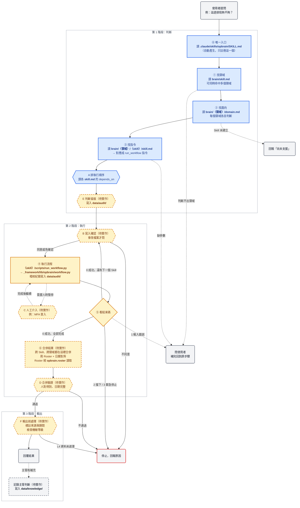
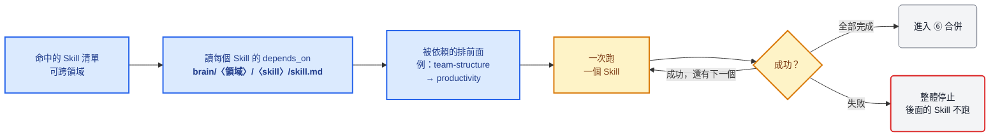
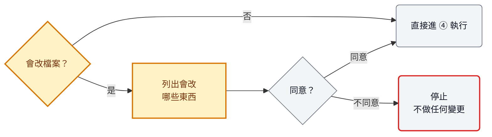
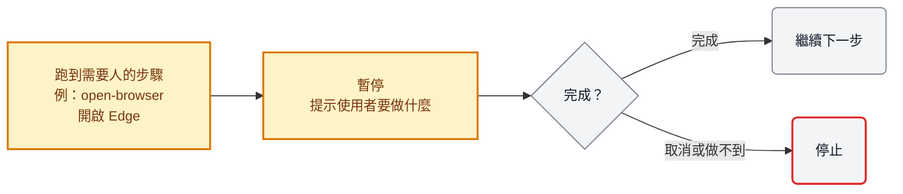
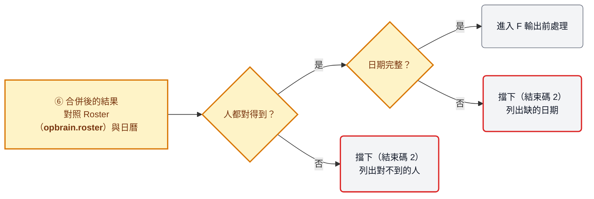
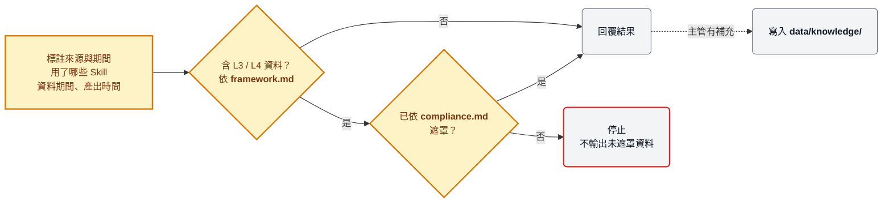

# 系統設計：母 skill.md 的領域分流

> 部分實作（2026-10-05）：⓪①②③、A、④⑤、check_all 的入口檢查已上線；標〔待實作〕的部分仍是設計。
> 子 Skill 放在擁有它的領域底下（`brain/〈領域〉/〈skill〉/`），和 `domain.md` 同一層；其他領域在自己的 `domain.md` 用路徑跨資料夾引用。

## 主圖

## 說明

**顏色與形狀**

| 標示 | 代表 | 由誰負責 |
|---|---|---|
| 藍色 | Skill 邏輯判斷：決定「要做什麼」 | AI 讀 md 檔（`SKILL.md`、`skill.md`、`domain.md`） |
| 黃色 | Module 程式執行：負責「實際去做」（包含寫入稽核、知識等紀錄） | Python 程式（`_framework/` 與各 Skill 的 `scripts/`） |
| 灰色 | 與使用者的互動 | 使用者 |
| 紅框 | 停止，回報原因 | — |
| 白底區塊 | 階段：判斷 → 執行 → 輸出。**只表示順序，不表示負責者**；同一階段可以有不同顏色的節點 | — |
| 方框 ⓪～⑥ | 主線步驟 | — |
| 虛線框〔待實作〕 | 還是設計，程式或文件尚未建立；實線框代表已上線 | — |
| 菱形 | 依結果分流的判斷 | — |
| 六角形 A～F | 檢查點，細節見下方子圖 | — |
| 虛線 | 例外或暫停：問使用者、等人工、尚未支援、選擇性紀錄 | — |
| **粗體路徑** | 資料夾／檔案規格，新領域照同一個路徑格式建立 | — |

**主線步驟**

| 步驟 | 做什麼 | 讀／跑哪個檔案 |
|---|---|---|
| ⓪ 唯一入口 | Claude Code 只看得到這一個入口，一律從 ① 開始，不會直接跳進子 Skill | `.claude/skills/opbrain/SKILL.md`（由 `sync_claude_skills.py` 產生） |
| ① 找領域 | 判斷問題屬於哪些領域，可同時命中多個 | `brain/skill.md` |
| ② 找面向 | 每個命中的領域各自判斷面向；Skill 還沒建立就回報「尚未支援」 | `brain/〈領域〉/domain.md` |
| ③ 找指令 | 把使用者的話對應到具體指令與參數 | `brain/〈領域〉/〈skill〉/skill.md` |
| ④ 執行流程 | 逐步跑腳本，自動寫稽核紀錄；命中多個 Skill 時，依 A 的順序一次跑一個，每個都經過 B、④、⑤ | `run_workflow.py` → `_framework/` |
| ⑤ 看結果 | 依結束碼決定：繼續、問使用者，或停止 | 結束碼 0／1／2／3 |
| ⑥ 合併結果 | 所有 Skill 都跑完後，跨 Skill、跨領域的結果在這裡用 Roster 與日曆對齊後合併 | Roster：`brain/_framework/lib/opbrain/roster.py`；日曆：〔待建〕 |

**資料夾規格**（`〈領域〉`、`〈skill〉` 換成實際名稱即可複用）

| 路徑 | 層 | 放什麼 | 對應步驟 |
|---|---|---|---|
| **.claude/skills/opbrain/SKILL.md** | 入口 | 唯一註冊的入口，自動產生，不手改 | ⓪ |
| **brain/_framework/tools/sync_claude_skills.py** | 框架 | 由 `brain/skill.md` 產生 ⓪，並檢查分流走得通（E-1～E-4） | ⓪ |
| **brain/skill.md** | 入口 | 領域對照表：關鍵字／任務目的 → 領域資料夾；description 要涵蓋所有子 Skill 的常見說法 | ① |
| **brain/README.md** | 入口 | Skill 一覽與依賴關係（〔待實作〕改由各 `skill.md` 的 `depends_on` **自動產生**） | — |
| **brain/〈領域〉/domain.md** | 領域 | 面向對照表：Aspect → 子 Skill | ② |
| **brain/〈領域〉/〈skill〉/skill.md** | 子 Skill | 使用者的話 → 指令；frontmatter **depends_on**（依賴的唯一來源） | ③ A |
| **brain/〈領域〉/〈skill〉/compliance.md** | 子 Skill | 機敏等級與遮罩方式（處理個資的 Skill 才需要） | F |
| **brain/〈領域〉/〈skill〉/scripts/run_workflow.py** | 子 Skill | 這個 Skill 有哪些 flow、每個 flow 的步驟 | ④ |
| **brain/_framework/lib/opbrain/workflow.py** | 框架 | 執行器：逐步執行、STOP、重試、結束碼 | ④⑤ |
| **brain/_framework/framework.md** | 框架 | 機敏等級 L1～L4 的定義 | F |
| **brain/_org/** | 組織 | 共用名詞、資料配置；Roster 讀取目前在 `brain/_framework/lib/opbrain/roster.py`（不符合 F-1，目標移到此層），日曆尚未建立 | ⑥ D |
| **brain/〈領域〉/domain.md** 的「領域」與 **brain/_org/** 的「組織」 | — | 兩者無關：領域是分流目錄，組織是共用名詞層 | — |
| **data/audit/** | 資料 | 稽核紀錄：AI 判斷與程式執行（只能附加） | E ④ |
| **data/knowledge/** | 資料 | 主管紀錄（只增修，不刪） | F |

---

## 子圖：檢查點

### A 排執行順序（藍色）

命中多個 Skill（包含跨領域）時，依各 Skill 在 `skill.md` frontmatter 的 `depends_on` 排順序。例如 productivity 依賴 team-structure，所以要先確認 Roster 是最新的。

### B 寫入確認（黃色）

只有會覆寫檔案或修改主檔的流程才需要確認，只讀取的流程直接執行。例如換新的 Roster、PBI 用 `--force` 重新下載。

### C 人工介入（黃色）

有些步驟只能由人完成，程式要停下來等，不能自動往下跑。例如 PBI 登入需要 MFA。

目前做法：先跑 `--flow open-browser` 開啟 Edge，使用者登入後，再另外跑 `--flow pbi`；流程內「暫停等人」尚未實作。

### D 合併驗證（黃色）

合併後再檢查一次，避免結果看起來完整、實際上有缺。

### E 判斷留痕（黃色）

目前稽核紀錄只記錄程式執行。AI 的判斷（選了哪個領域、哪個 Skill、為什麼）也要留下紀錄，稽核時才能還原「為什麼跑了這個流程」。判斷紀錄與後續執行紀錄共用同一個 `run_id`。

### F 輸出前處理（黃色）

回覆前先標註資料來源，並檢查機敏等級；回覆後，主管的判斷或補充可以寫回知識庫，下次就能用上。

---

## 驗證：check_all 檢查資料夾規格

`brain/_framework/tools/check_all.py` 自動檢查以下項目，任一項不符就失敗：

| ID | 檢查項目 | 擋下的狀況 | 狀態 |
|---|---|---|---|
| E-1 | `brain/skill.md` 存在，frontmatter 有 name、description | 入口遺失，⓪ 無法產生 | 已實作 |
| E-2 | `brain/skill.md` 對照表的每個領域，都有對應的 `brain/〈領域〉/domain.md` | 對照表指到不存在的資料夾 | 已實作 |
| E-3 | 每個 Skill 都被至少一個 `domain.md` 收錄 | 新 Skill 忘了收錄，從入口走不到 | 已實作 |
| E-4 | `domain.md` 引用的每個 `skill.md` 都存在 | 面向指到不存在的 Skill | 已實作 |
| — | 每個 `skill.md` 都有 `depends_on`，依賴的 Skill 都存在 | 依賴寫錯名字或漏寫 | 已有（S-5 只檢查欄位存在） |
| — | 依賴關係沒有循環 | A 依賴 B、B 又依賴 A，A 檢查點無法排序 | 待實作 |
| — | `brain/README.md` 的依賴表與各 `skill.md` 一致 | 有人手改 README | 待實作 |
| — | 處理 L3／L4 資料的 Skill 都有 `compliance.md` | F 檢查點沒有遮罩規則可依循 | 待實作 |

---

## 原則

- **只有一個入口。** `.claude/skills/` 只註冊 `opbrain`，子 Skill 一律經過 ①② 才到得了。
- **藍色只定位，黃色才動手。** 業務規則與指令寫在子 Skill 的 md，執行一律交給程式。
- **判斷不出來就問。** 虛線會回到使用者，不猜；Skill 還沒建立就直說「尚未支援」。
- **被擋下就停。** 結束碼 2、3 或驗證不通過，只回報原因，不繞過。
- **前面停，後面不跑。** 多個 Skill 時，任何一個失敗，整體停止。
- **改東西前先問。** 會覆寫檔案或修改主檔，一定先經過使用者同意。
- **判斷也要留痕。** AI 的判斷和程式的執行，都寫進同一份稽核紀錄。
- **依賴只寫一處。** 依賴寫在各 `skill.md`，README 自動產生。
- **回覆前先檢查機敏。** L4 資料沒遮罩就不輸出。
