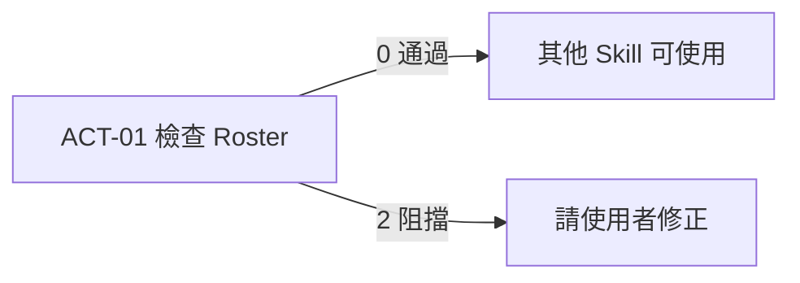

# 流程 check：檢查與更換 Roster（team-structure）

> **核心問題**：怎麼檢查、更換 Roster，以及某人對不到時怎麼查？
> **狀態**：`active`｜**最後更新**：2026-10-04｜**負責人**：Howard Huang（OP）

## 指令
```
python brain/team-structure/scripts/run_workflow.py --flow check [--roster <檔>]
```



## 輸入
| 情境 | 必要輸入 | 缺少時 |
|---|---|---|
| check | `data/raw/roster/Roster.xlsx`，或 `--roster <檔案>` | 結束碼 1，提示檔案不存在 |
| 換 Roster | 使用者提供的新檔案路徑 | 請使用者提供，不自行從其他地方找 |

Roster 的來源與欄位見 `rules.md`。

## 步驟

### 換新的 Roster（使用者給新檔時）
| 步驟 | 動作 | 負責人 | 完成條件 |
|---|---|---|---|
| 1 | 先檢查新檔：`--flow check --roster "<新檔>"` | AI | 無阻擋問題（正式姓名欄是第一欄，C-001） |
| 2 | 與現有 Roster 比較：新增／移除的人、欄名變化 | AI | 列給使用者看 |
| 3 | 覆蓋 `data/raw/roster/Roster.xlsx`（若要跑 Fresh，也可由 productivity:ACT-10 一起換） | AI | 檔案已更新 |
| 4 | 回報（見下方「回報」） | AI | 使用者知悉 |

### 查某人為什麼對不到
1. 用 `opbrain.roster.op_name_set()` / `lark_to_op_map()` 確認 Roster 裡的寫法
2. 到該報表的原始資料搜尋相近寫法（姓名順序、大小寫、空白、零寬字元）
3. 把證據給使用者，由使用者決定是否改 Roster（D-001）

### 動作
| 動作 ID | 說明 | 實作 | 輸入 | 前置條件 | 效果 | 冪等 | 可逆 |
|---|---|---|---|---|---|---|---|
| ACT-01 | 檢查 Roster 健康狀況 | `scripts/roster_check.py` | Roster 檔 | 檔案存在 | 寫 `<workdir>/roster_check.json`（只讀 Roster） | Y | Y |

ACT-01 只讀，可隨時自動執行；目前沒有排程，由使用者或 AI 在換 Roster 時觸發。未來 Roster 改從 Lark Drive 同步時，同步後自動跑 ACT-01 `[待確認]`。

## 檢查與判定
| 檢查 ID | 內容 | 結果 |
|---|---|---|
| V-001 | 正式姓名欄存在（R-002），且為第一欄 | 不存在 → 阻擋；不在第一欄 → 警告 |
| V-002 | 空白姓名列 | 警告並計數 |
| V-003 | 單字姓名 | 警告並列名 |
| V-004 | 正式姓名重複 | 阻擋 |
| V-005 | 缺 Lark Name、Lark Name 重複 | 警告並列名 |

| 標準 ID | 項目 | 通過 | 警告 | 阻擋 |
|---|---|---|---|---|
| C-001 | 正式姓名欄 | 存在且為第一欄 | 存在但不在第一欄 | 不存在 |
| C-002 | 姓名重複 | 0 | — | ≥ 1 |
| C-003 | 空白姓名列、單字姓名、缺 Lark Name | 0 | ≥ 1（列出名單） | — |

驗收：使用者。條件是 ACT-01 無阻擋問題，且使用者看過警告名單。

品質觀察：
| 面向 | 衡量 | 目前 |
|---|---|---|
| 完整 | 有正式姓名的人數 / 總列數 | 108 / 110（2026-09） |
| 一致 | 其他報表對不到的人數 | AC Chatgroup 9 月 1 人（Adrian Chan，已離職）；Fresh 全 0 員工 12 人（多為主管或新人） |
| 及時 | Roster 版本月份 = 報表月份 | 人工確認 |

## 例外與失效
| ID | 情境 | 處置 |
|---|---|---|
| E-001 | 新人沒有正式姓名（空白列） | 略過（R-003），在檢查報告列出，提醒使用者補 |
| E-002 | 只有名字沒有姓氏（例：Marcus） | 保留，但警告：子字串比對可能誤中他人 |
| E-003 | Roster 改欄名 | D-002 |
| F-001 | Roster 檔不存在或不可讀 | 結束碼 1；依賴 Roster 的流程全部停止，請使用者放回檔案 |
| F-002 | 找不到正式姓名欄 | 結束碼 2（關卡）；照 D-002 詢問使用者 |

## 輸出與回報
| 交付物 | 給誰 | 位置 | 格式 | 保存 |
|---|---|---|---|---|
| Roster 檢查報告 | 使用者 | `data/work/team-structure/check/<時間>/roster_check.json` | UTF-8 JSON：`roster`、`name_column`、`people`、`blockers[]`、`warnings[]`、`tag_distribution{欄位: {值: 人數}}` | 可隨時刪除（可重跑） |
| 現行 Roster | 所有 Skill | `data/raw/roster/Roster.xlsx` | — | 覆蓋前由使用者保留原檔 |

回報給使用者：人數、正式姓名欄名、各標籤人數、警告名單（空白姓名、單字名、缺 Lark Name）、與上一版的差異（新增／移除）。不貼完整名冊。

## 測試
| 測試 ID | 內容 | 預期 |
|---|---|---|
| TC-001 | 以 2026-09 Roster 跑 check | 108 人、警告：2 空白列、Marcus 單字名、4 人缺 Lark Name；無阻擋 |
| TC-002 | Roster 使用舊表頭 `OP Name` 與新表頭 `CRM OP Name` | 兩者都能讀到相同名單 |

productivity 的回歸測試（`brain/productivity/scripts/regression_check.py`）也間接驗證 R-002～R-005。

[來源: scripts/roster_check.py、scripts/run_workflow.py；2026-10-01 換 Roster 實際操作；2026-10-02 roster_check 執行結果]
